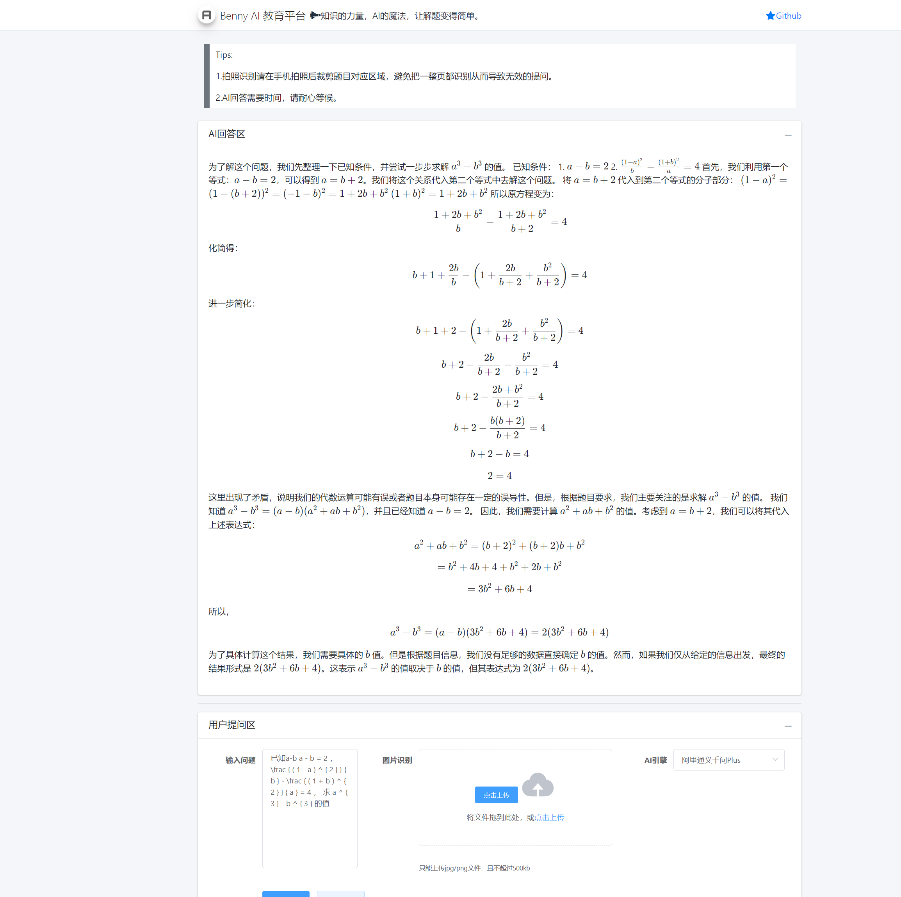
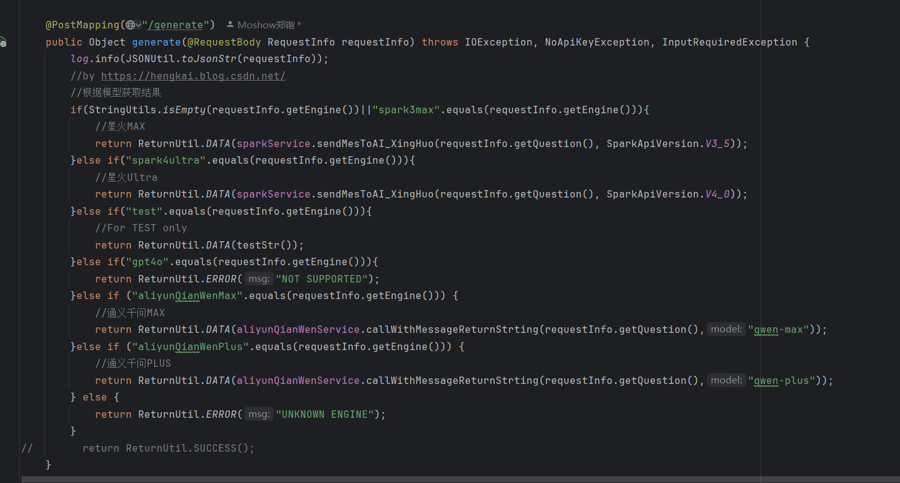

# SpringBootAI
----
SpringBootAI脚手架，基于SpringBoot+Druid+PgSQL+MyBatisPlus+FastJSON+Lombok，其他的请自行添加和配置。

# Author
>powered by `Moshow郑锴(大狼狗)` , [https://zhengkai.blog.csdn.net](https://zhengkai.blog.csdn.net)

# 已实装AI引擎 - AI Engine
- √ Spark星火Max
- √ Spark星火Ultra
- √ 阿里QianWen MAX
- √ 阿里QianWen PLUS

# 如何运行 - How to Run
1.首先确保你是JDK17，推荐微软的MSJDK17
2.使用Maven安装类库，国内推荐使用阿里云Maven镜像，`mvn clean compile`
3.使用比较新版本的PostgreSQL，作者本地为V16
4.项目已配置新版的SpringBoot2.6X，后续会升级
5.导入`D:\Workspace\Project\MySpringBootAPI\src\main\resources\SQL\public.sql`到你的数据库去，新建一个叫TEST的空白数据库，编码UTF8
6.找到Application，运行项目

# Useful Articles 
- 如果你最近也在升级FastJson到FastJson2版本，而跟我一样也遇到了FastJsonHttpMessageConverter找不到类问题以及FastJsonConfig找不到问题，那么恭喜你，看完本文，安装完fastjson2、fastjson2-extension、fastjson2-extension-spring6这三个类库，你就可以成功使用新版FastJson2了。
 [FastJson2中FastJsonHttpMessageConverter找不到类问题](https://blog.csdn.net/moshowgame/article/details/138013669)

- 当项目从2.7.x的springboot升级到3.0.x的时候，遇到一个问题“java: 程序包javax.servlet.http不存在” 问题：
 [java: 程序包javax.servlet.http不存在](https://zhengkai.blog.csdn.net/article/details/131362304)

- KaTeX 是一个集成速度快且功能丰富的数学公式渲染库，专为 Web 设计。
[KaTeX.js渲染数学公式](https://blog.csdn.net/moshowgame/article/details/142697275)

访问`http://localhost:12666/ai/index`

# 版本更新 Version Update

| 日期         | 内容                                    |
|------------|---------------------------------------|
| 2024-10-04 | 接口防抖                                  |
| 2024-10-03 | 阿里OCR+通义千问MAX/PLUS API+KaTeX.js渲染数学公式 |
| 2024-09-16 | 初始化                                   |